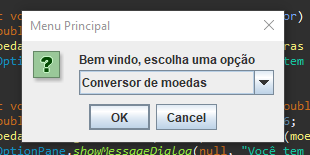
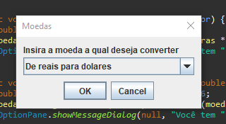
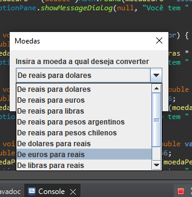
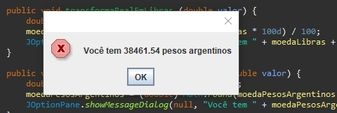
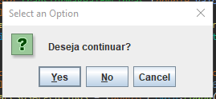
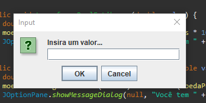

# Bem vindo ao Conversor de Moedas, BY Rafael Lima

### Nesta oportunidade foi solicitado para nós Devs a criação de um conversor de ### moeda utilizando a linguagem Java. As características solicitadas por nosso ### cliente são as seguintes:

## Exigênicias do cliente
     - Converter de Reais a Dólar
     - Converter de Reais a Euro
     - Converter de Reais a Libras Esterlinas
     - Converter de Reais a Peso argentino
     - Converter de Reais a Peso Chileno
### Lembrando que deve ser possível também converter de forma inversa ou seja:

       - Converter de Dólar a Reais
       - Converter de Euro a Reais
       - Converter de Libras Esterlinas a Reais
       - Converter de Peso argentino a  Reais
       - Converter de Peso Chileno a Reais

## Uma aplicação JAVA direcionada a conversão de moedas, com comandos simples, e interface de fácil entendimento.

## Tela Inicial

# Escolha de moeda

## Valor que deseja converter

## Mensagem com valor convertido...

## Mensagem final, com opção de realizar novo cálculo no programa

## Mensagem de erro, quanto a campo vazio de valor, ou entrada de caracter não permitido.
